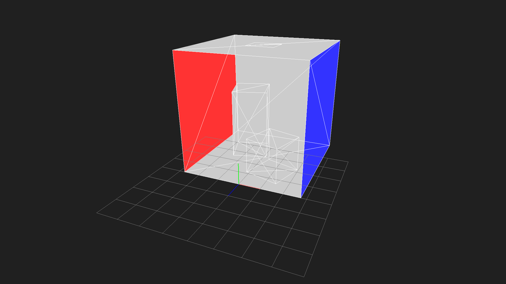

# CEDEC-2024-RT

[English](https://github.com/yumcyaWiz/CEDEC-2024-RT/blob/main/README.md) | [日本語](https://github.com/yumcyaWiz/CEDEC-2024-RT/blob/main/README_JP.md)


This is the code example for CEDEC 2024 "[Easy Start with GPU Ray Tracing! From GPU Programming Basics to ReSTIR](https://cedec.cesa.or.jp/2024/session/detail/s6607f1689d540/)".

Please also refer to the [slides](https://github.com/yumcyaWiz/CEDEC-2024-RT/blob/main/docs/CEDEC2024_RT.pdf) used during the presentation.

## How to Build

First, download the dependent libraries.

```bash
git submodule update --init --recursive
```

### Windows

Run Premake to create Visual Studio solution files.

```bash
./premake5.exe vs2022
```

For NVIDIA users only.

```bash
./premake5.exe vs2022 --nvidia
```

Open `build/CEDEC_2024_RT.sln` in Visual Studio and build.

### Linux

Run Premake to create a Makefile.

```bash
./premake5 gmake2
```

Execute the build using `make` in the `build` directory.

```
cd build
make
```

### Build Configurations

|Mode|CPU Code Optimization|GPU Code Optimization|
|:--|:--|:--|
|Debug||✔|
|DebugGpu|||
|RelWithDebInfo|✔|✔|

## About Examples

There are 10 implementation examples, ranging from very simple ones to ReSTIR implementation.

|Mouse Operation|Description|
|:--|:--|
|`LMB`|Rotate camera|
|`RMB`|Zoom in/out camera|
|`MMB`|Move camera|

### 01_helloworld

An example that simply fills pixels with a gradient.


### 02_triangle

An example of displaying a triangle using ray tracing.


### 03_cornellbox

An example of displaying a Cornell box using ray tracing. It directly displays the color of the triangle hit by the ray from the camera.



### 04_ao

An example of calculating ambient occlusion using ray tracing in a simple Cornell box scene.


### 05_ao_boundingbox

Calculates ambient occlusion in a more complex scene. It's slightly faster as it terminates calculations early using AABBs. You can see the performance of brute-force calculation by using `#define ENABLE_AABB_CULLING 0` in 05_ao_boundingbox.cu.

<details>

<summary>Advanced Tips</summary>

Using `#define ENABLE_AABB_WARP_LEVEL_CULLING 1` performs an additional level of hierarchical culling with AABBs that group 32 together.

</details>


### 06_ao_hiprt

A version that uses HIPRT for ray-scene intersection tests. Calculation becomes overwhelmingly faster on both NVIDIA and AMD GPUs. Especially for AMD GPUs, it can utilize hardware ray tracing capabilities.


### 07_pt

An example of path tracing.

|Operation|Description|
|:--|:--|
|`A`|Toggle Accumulation On/Off|
|`S`|Save screenshot|


### 08_nee

An example implementing Next Event Estimation. Compared to naive path tracing, it has a higher chance of reaching light sources, thus reducing noise.

|Operation|Description|
|:--|:--|
|`A`|Toggle Accumulation On/Off|
|`S`|Save screenshot|


### 09_ris

An implementation example of Resampled Importance Sampling (RIS).

|Operation|Description|
|:--|:--|
|`1`|Toggle RIS On/Off|
|`2`|Include/Exclude Visibility in Target function evaluation|
|`A`|Toggle Accumulation On/Off|
|`S`|Save screenshot|


### 10_restir_di

An implementation example of ReSTIR DI.

|Operation|Description|
|:--|:--|
|`1`|Toggle Temporal Resampling On/Off|
|`2`|Toggle Spatial Resampling On/Off|
|`3`|Include/Exclude Visibility in Target function evaluation|
|`4`|Toggle Visibility reuse On/Off|
|`A`|Toggle Accumulation On/Off|
|`S`|Save screenshot|


## Dependencies

* [Orochi](https://github.com/GPUOpen-LibrariesAndSDKs/Orochi)
* [HIP RT](https://gpuopen.com/hiprt/)
* [GLFW](https://www.glfw.org/)
* [stb](https://github.com/nothings/stb)
* [tinyobjloader](https://github.com/tinyobjloader/tinyobjloader)

## Contact

If you have any questions about the code or slide content, please contact:

|Name|Address|
|:--|:--|
|Kenta Eto|Kenta.Eto@amd.com|
|Atsushi Yoshimura|Atushi.Yoshimura@amd.com|

## Citations

* [1] https://cedec.cesa.or.jp/2024/session/detail/s6607f1689d540/
* [2] https://github.com/yumcyaWiz/CEDEC-2024-RT/blob/main