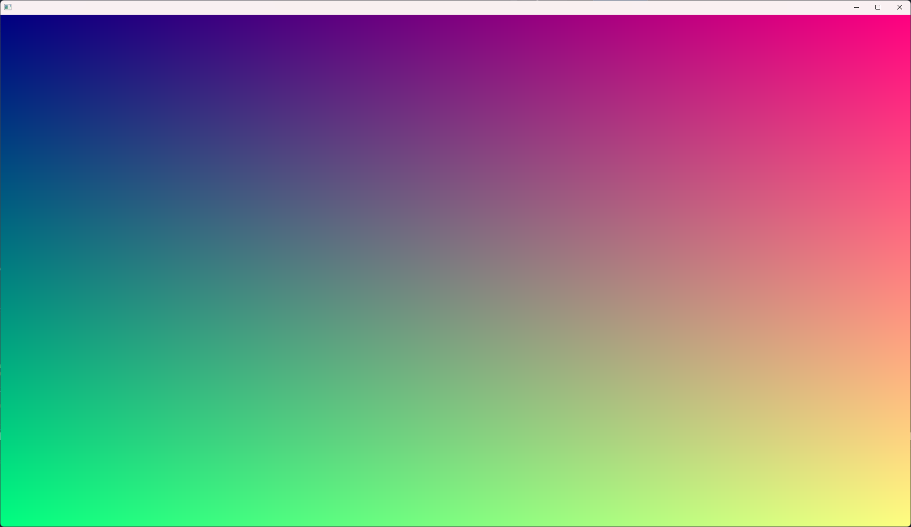
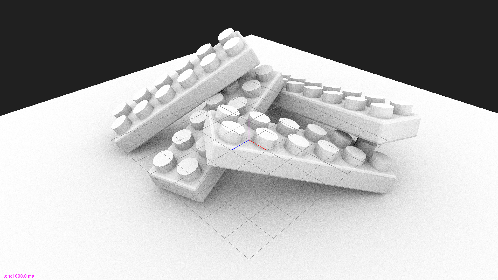
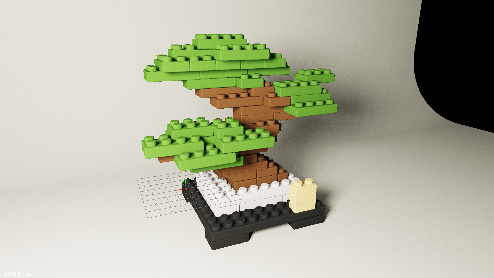

# CEDEC-2024-RT


CEDEC 2024 "[手軽に始めるGPUレイトレーシング！GPUプログラミングの基本からReSTIRまで](https://cedec.cesa.or.jp/2024/session/detail/s6607f1689d540/)" のコード例です。

講演時の[スライド](https://github.com/yumcyaWiz/CEDEC-2024-RT/blob/main/docs/CEDEC2024_RT.pdf)もあわせて参照ください。

## ビルド方法

まず依存ライブラリを落としてきます。

```bash
git submodule update --init --recursive
```

### Windows

Premakeを実行してVisual Studioソリューションファイルを作成します。

```bash
./premake5.exe vs2022
```

NVIDIA ユーザーのみ対象です。

```bash
./premake5.exe vs2022 --nvidia
```

`build/CEDEC_2024_RT.sln`をVisual Studioで開き、ビルドしてください。

### Linux

Premakeを実行してMakefileを作成します。

```bash
./premake5 gmake2
```

`build`ディレクトリにおいて`make`を用いてビルドを実行します。

```
cd build
make
```

### Build Configurations

|モード|CPUコード最適化|GPUコード最適化|
|:--|:--|:--|
|Debug||✔|
|DebugGpu|||
|RelWithDebInfo|✔|✔|

## Exampleについて

非常に簡単なものから、ReSTIRの実装まで段階的に10個の実装例があります。

|マウス操作|説明|
|:--|:--|
|`LMB`|カメラの回転|
|`RMB`|カメラのズームイン/アウト|
|`MMB`|カメラの移動|

### 01_helloworld

ピクセルをグラデーションで塗りつぶすだけの例です。



### 02_triangle

レイトレーシングで三角形を表示する例です。


### 03_cornellbox

レイトレーシングでコーネルボックスを表示する例です。カメラからのレイがヒットした三角形の色をそのまま画面に表示します。


### 04_ao

シンプルなコーネルボックスのシーンで、レイトレーシングを使ったアンビエントオクルージョンを計算する例です。


### 05_ao_boundingbox

より複雑なシーンで、アンビエントオクルージョンを計算します。AABBを使って早期に計算を打ち切るため、少し速くなります。05_ao_boundingbox.cuで `#define ENABLE_AABB_CULLING 0` を使うと、総当たりをしたときのパフォーマンスを見ることもできます。
<details>

<summary>発展的Tips</summary>

`#define ENABLE_AABB_WARP_LEVEL_CULLING 1` を使うと、32個を一つにまとめたAABBでさらにもう一段階層的なカリングを行います。

</details>



### 06_ao_hiprt

レイとシーンの交差判定にHIPRTを使ったバージョンです。NVIDIA GPU, AMD GPU共に圧倒的に計算が速くなります。特にAMG GPUの場合、ハードウェアレイトレーシングの機能を活用することが出来ます。


### 07_pt

パストレーシングの例です。

|操作|説明|
|:--|:--|
|`A`|AccumulationのOn/Off|
|`S`|スクリーンショットの保存|


### 08_nee

Next Event Estimationを実装した例です。ナイーブなパストレーシングと比べて光源に到達する可能性が高まるのでノイズが減ります。

|操作|説明|
|:--|:--|
|`A`|AccumulationのOn/Off|
|`S`|スクリーンショットの保存|



### 09_ris

Resampled Importance Sampling (RIS)の実装例です。

|操作|説明|
|:--|:--|
|`1`|RISのOn/Off|
|`2`|Target functionの評価にVisibilityを含める/含めない|
|`A`|AccumulationのOn/Off|
|`S`|スクリーンショットの保存|


### 10_restir_di

ReSTIR DIの実装例です。

|操作|説明|
|:--|:--|
|`1`|Temporal ResamplingのOn/Off|
|`2`|Spatial ResamplingのOn/Off|
|`3`|Target functionの評価にVisibilityを含める/含めない|
|`4`|Visibility reuseのOn/Off|
|`A`|AccumulationのOn/Off|
|`S`|スクリーンショットの保存|


## Dependencies

* [Orochi](https://github.com/GPUOpen-LibrariesAndSDKs/Orochi)
* [HIP RT](https://gpuopen.com/hiprt/)
* [GLFW](https://www.glfw.org/)
* [stb](https://github.com/nothings/stb)
* [tinyobjloader](https://github.com/tinyobjloader/tinyobjloader)

## Contact

コードやスライドの内容に関して質問等がありましたら、以下までご連絡ください。

|Name|Address|
|:--|:--|
|江藤 健汰|Kenta.Eto@amd.com|
|吉村 篤|Atushi.Yoshimura@amd.com|